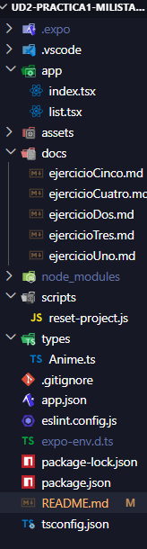

# 🎌 PGL-MyList-Anime

Aplicación móvil desarrollada con **React Native (Expo)** para gestionar una lista personal de animes. Permite añadir, marcar como vistos y eliminar animes, con indicadores numéricos en tiempo real.

---

## ¿Qué hace la aplicación?

La aplicación consta de dos pantallas:

**Pantalla de inicio (`index.tsx`)**
Muestra una portada con imagen de fondo, el título de la app y un botón para acceder a la lista.

**Pantalla de lista (`list.tsx`)**
Es la pantalla principal. Permite:
- Ver todos los animes añadidos en tarjetas individuales
- Consultar tres indicadores numéricos: total de animes, cuántos están marcados como vistos y el precio total acumulado de los vistos
- Añadir nuevos animes mediante un formulario en modal
- Marcar o desmarcar cada anime como visto individualmente
- Eliminar animes de forma individual
- Vaciar la lista completa con un solo botón (deshabilitado si no hay nada)
- Ver un mensaje informativo cuando la lista está vacía

---

##  Documentación por ejercicios
[Ejercicio Uno](docs/ejercicioUno.md)
[Ejercicio Dos](docs/ejercicioDos.md)
[Ejercicio Tres](docs/ejercicioTres.md)
[Ejercicio Cuatro](docs/ejercicioCuatro.md)
[Ejercicio Cinco](docs/ejercicioCinco.md)
---

## 🗂️ Estructura del proyecto

## Tecnologías utilizadas

| Tecnología | Uso |
|------------|-----|
| React Native + Expo | Framework principal de la app |
| TypeScript | Tipado estático del código |
| Expo Router | Navegación entre pantallas |
| `uuid` (v4) | Generación de IDs únicos para cada anime |
| `useState` | Gestión del estado de la lista y el formulario |
| `FlatList` | Renderizado eficiente de la lista |
| `Modal` | Ventana emergente para el formulario de añadir |

##  Instalación y ejecución

# 1. Instalar dependencias
npm install

# 2. Arrancar la aplicación
npx expo start

# Aplicacion Hecha Por:
Gabriel David Gelviz Monterrey.