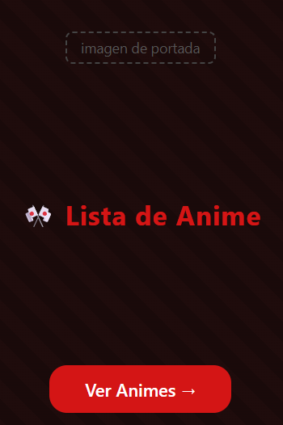
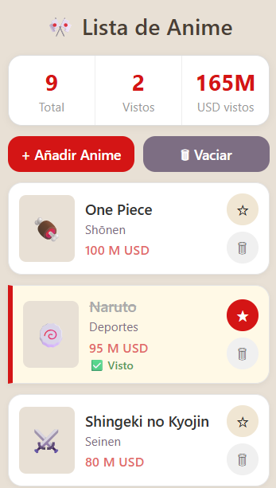
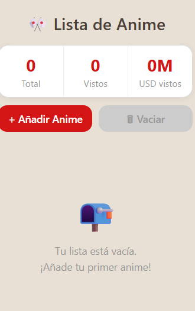
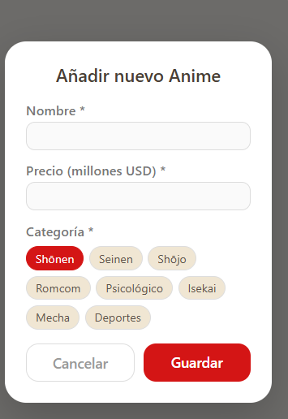

# Diseñar aplicación.

## Objetivo.
Se diseñaron las pantalla para implementar el listado de los animes para que aparezcan de manera clara y con su funcionalidad correspondiente.

## Pantalla Diseñadas.

### Pantalla de inicio.

Esta pantalla tiene la imagen de fondo que ocupa toda la pantalla,
tiene un titulo "Lisa de anime". Y tiene un boton de "Ver animes"
para poder navegar a la pantalla de lista.

### Pantalla de lista

### Pantalla de lista(VACIA)

### Pantalla de añadir anime

## Categoria definidas.
Se definieron 8 categorías fijas, cada una con una imagen asociada:

| Categoría    | Imagen asociada  |
|--------------|-----------------|
| Shōnen       | onepiece.jpg    |
| Seinen       | ataque.jpg      |
| Shōjo        | kimetsu.jpg     |
| Romcom       | sono.jpg        |
| Psicológico  | monster.jpg     |
| Isekai       | solo.jpg        |
| Mecha        | black.jpg       |
| Deportes     | naruto.jpg      |

[Volver Al README](../README.md)